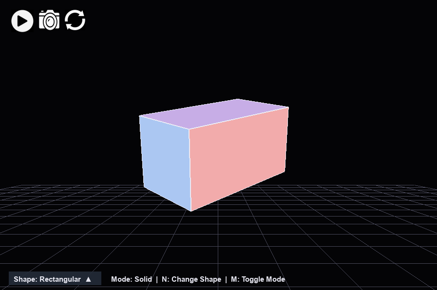
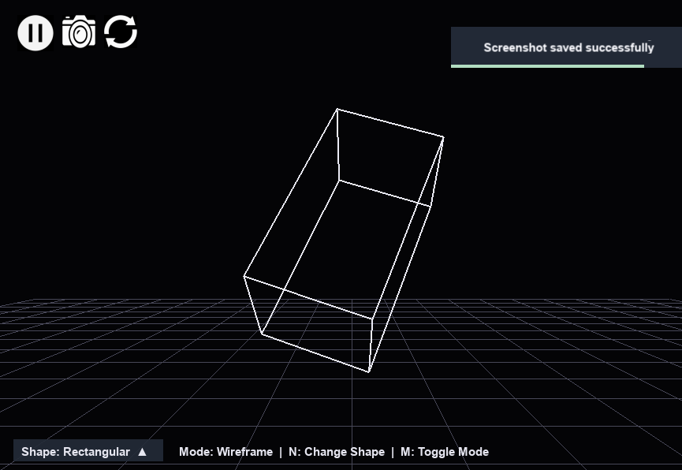
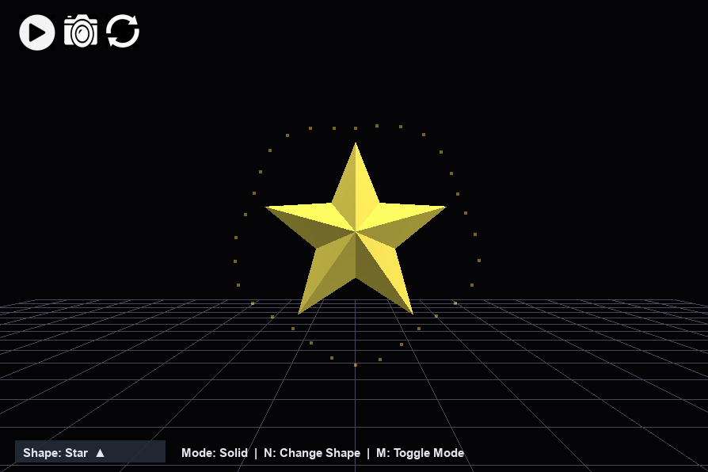
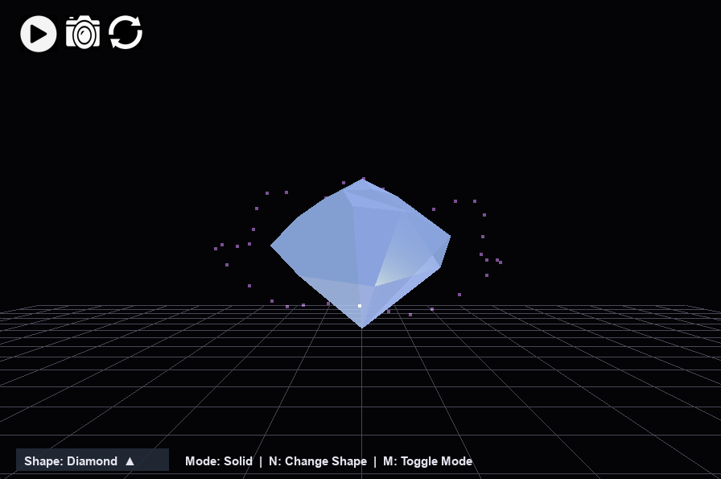
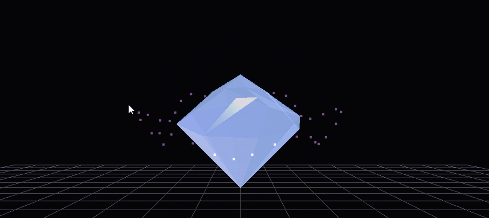

# PyOpenGL 3D Visualizer

**A real-time interactive 3D visualization system built with Python, PyOpenGL, and Pygame.**

This project demonstrates core computer graphics concepts including shader-based rendering, real-time lighting models, custom geometry generation, and event-driven user interaction — implemented through a clean, modular software architecture.

---

## Overview

The PyOpenGL 3D Visualizer provides an interactive environment for exploring 3D geometry with physically-inspired materials and dynamic lighting. Each shape features a dedicated rendering pipeline implemented via GLSL shaders, enabling visual effects such as Fresnel reflections, transparency, specular highlights, and animated glow.

The system is designed around three core principles:

- **Separation of concerns** — rendering, camera, UI, and geometry logic are fully decoupled
- **Extensibility** — new shapes can be added by subclassing `BaseShape` with minimal boilerplate
- **Real-time interactivity** — all effects and transitions run at interactive frame rates

---

## Available Shapes

| Shape | Rendering Style |
|---|---|
| Cube | Phong shading |
| Pyramid | Phong shading |
| Octahedron | Phong shading |
| Rectangular Prism | Phong shading |
| Glow Star | Faceted + animated emission |
| Glossy 3D Heart | Custom geometry + specular shader |
| Shader Diamond | Fresnel + specular + glow |
| Crystal | Transparency + reflections |

---

## Controls

| Input | Action |
|---|---|
| `W` `A` `S` `D` | Move camera |
| Mouse drag | Rotate object |
| `Q` / `E` | Zoom in / out |
| `Space` | Play / pause animation |
| `N` | Cycle to next shape |
| `M` | Toggle wireframe / solid mode |
| `P` | Save screenshot |

---

## Installation

**Prerequisites:** Python 3.13, pip

```bash
git clone https://github.com/your-username/pyopengl-3d-visualizer.git
cd pyopengl-3d-visualizer
pip install -r requirements.txt
python main.py
```

### Dependencies

| Package | Purpose |
|---|---|
| PyOpenGL | OpenGL bindings and rendering context |
| Pygame | Window management and input handling |
| GLSL (via PyOpenGL) | Vertex and fragment shader execution |

---

## Project Structure

```
pyopengl-3d-visualizer/
│
├── main.py                  # Entry point
│
├── src/
│   ├── app.py               # Application lifecycle and main loop
│   ├── renderer.py          # OpenGL rendering pipeline
│   ├── camera.py            # Camera transforms and controls
│   ├── ui.py                # UI elements and event handling
│   └── config.py            # Global configuration constants
│
├── objects/
│   ├── base_shape.py        # Abstract base class for all shapes
│   ├── shape_manager.py     # Shape registry and switching logic
│   ├── cube.py
│   ├── pyramid.py
│   ├── octahedron.py
│   ├── rectangular_prism.py
│   ├── star.py
│   ├── heart.py
│   └── crystal.py
│
└── assets/
    ├── screenshots/
    ├── demo/
    └── ui/
```

---

## Architecture Notes

All renderable objects inherit from `BaseShape`, which defines the interface for geometry generation, shader binding, and per-frame updates. The `ShapeManager` handles registration and runtime switching between shapes without requiring changes to the rendering loop.

The rendering pipeline in `renderer.py` is stateless with respect to individual shapes — each shape owns its shader program and vertex data, keeping the renderer generic and reusable.

---

## 📸 Screenshots

<p align="center">
  
  
</p>

<p align="center">
  
  
</p>
---
## 🎥 Demo

<p align="center">
  <a href="https://www.youtube.com/watch?v=6CYqQmSBlWE">
    
  </a>
</p>

⬇️ **Download Video**  
[Download Demo](assets/readme_img_video/demo.mp4)
---

## Author

**Öykü Eyüboğlu**  
Computer Engineering Student